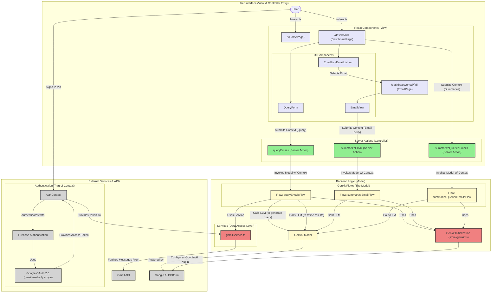

# MailSage Application Architecture

This document outlines the architecture of the MailSage application, a Next.js app using Genkit for AI-powered Gmail interaction.

## Design Pattern: Model Context Protocol (MCP)

The application is structured following the principles of the **Model Context Protocol (MCP)**. This pattern is particularly well-suited for modern, AI-driven applications where a packet of information (the Context) is progressively transformed by different services according to a defined sequence (the Protocol).

*   **Model:** The core business logic and data transformation engine. In our app, this is handled by the **Genkit Flows** (e.g., `queryEmailsFlow`). The Model is responsible for the "heavy lifting": executing AI prompts, calling external services like the Gmail API, and structuring the final output. It is the brain of the operation.

*   **Context:** A "packet" of data that travels through the system. It originates from the user (e.g., their natural language query) and is progressively enriched as it moves through the protocol. It includes the user's query, authentication tokens, intermediate data like the raw list of emails from Gmail, and the final, summarized results.

*   **Protocol:** The defined sequence of steps for communication and data transformation. It dictates how the Context moves between different layers of the application.
    1.  The **View** (React Components) captures the initial user input, creating the starting Context.
    2.  The **Controller** (Next.js Server Actions) receives this Context, adds necessary credentials (like the Google Access Token from `AuthContext`), and invokes the Model.
    3.  The **Model** (Genkit Flow) executes its internal, multi-step protocol on the Context: transforming the query, fetching data, refining results, etc.
    4.  The final, enriched Context is returned back up the chain to the View to be displayed to the user.

This separation makes the application robust and scalable. The complex AI orchestration is neatly encapsulated within the Model, which acts on a well-defined Context object following a clear Protocol.

---

## System Architecture Diagram

The following diagram illustrates the main components of the MailSage application and their interactions, reflecting the MCP pattern. The "Context" flows from the user, through the UI and Server Actions, is processed by the Backend Logic (Model), and returns to the user.

## Data Flow Summary (The Protocol in Action):

1.  **Sign-In & Context Initialization:** The user signs in. `AuthContext` uses Firebase/Google OAuth to create the initial **Context**, containing the user's identity and a Gmail API `accessToken`.
2.  **User Query (View -> Controller):** The user types a query into `QueryForm`. This action calls the `queryEmails` Server Action, passing a **Context** object containing the user's query text.
3.  **Context Enrichment (Controller -> Model):** The `queryEmails` Server Action enriches the **Context** with the `accessToken` from `AuthContext` and then invokes the `queryEmailsFlow` (the Model).
4.  **Model Execution:** The `queryEmailsFlow` executes its multi-step protocol on the **Context**:
    *   **LLM Call 1:** It sends the `query` from the **Context** to Gemini to transform it into a structured Gmail API search string, adding the result back to the **Context**.
    *   **Service Call:** It uses the new search string and the `accessToken` from the **Context** to call `gmailService`, which fetches email metadata. The results are added to the **Context**.
    *   **LLM Call 2:** It takes the email snippets from the **Context** and sends them back to Gemini for relevance filtering and summarization.
5.  **Final Context (Model -> Controller -> View):** The flow returns the final, fully enriched **Context** containing a structured list of `QueriedEmail` objects. The Server Action passes this back to the `DashboardPage`, which updates its state and displays the results.

This architecture ensures that each part of the application has a clear, distinct responsibility, leading to a more organized and scalable system.