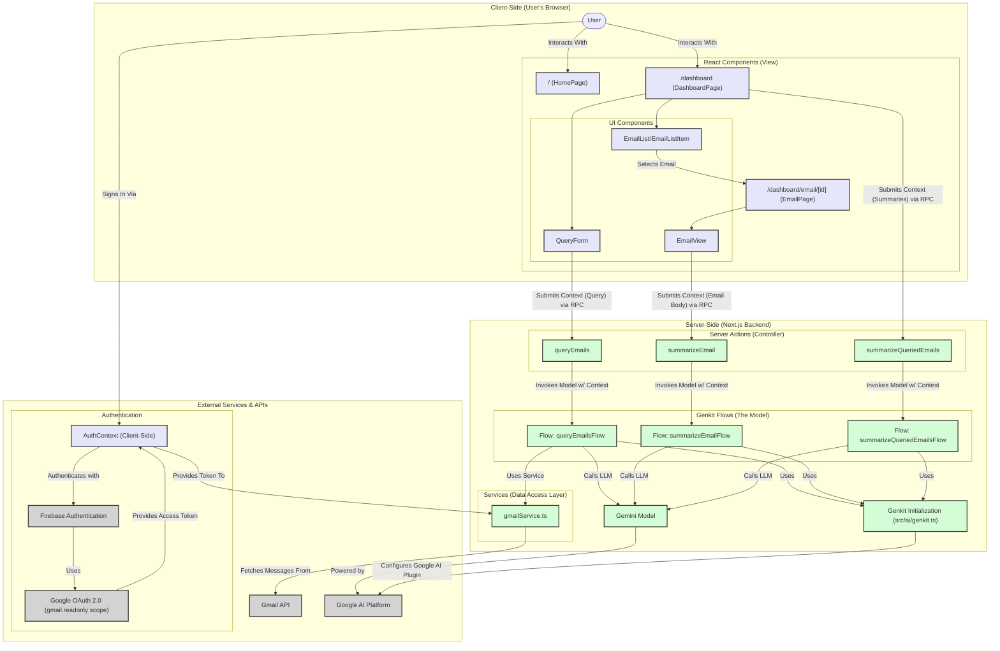

# MailSage Application Architecture

This document outlines the architecture of the MailSage application, a Next.js app using Genkit for AI-powered Gmail interaction.

## Design Pattern: Model Context Protocol (MCP)

The application is structured following the principles of the **Model Context Protocol (MCP)**. This pattern is particularly well-suited for modern, AI-driven applications where a packet of information (the Context) is progressively transformed by different services according to a defined sequence (the Protocol).

*   **Model:** The core business logic and data transformation engine. In our app, this is handled by the **Genkit Flows** (e.g., `queryEmailsFlow`) which run exclusively on the server. The Model is responsible for the "heavy lifting": executing AI prompts, calling external services like the Gmail API, and structuring the final output.

*   **Context:** A "packet" of data that travels through the system. It originates from the user on the client, is passed to the server, and is progressively enriched as it moves through the protocol. It includes the user's query, authentication tokens, intermediate data like the raw list of emails from Gmail, and the final, summarized results.

*   **Protocol:** The defined sequence of steps for communication and data transformation. It dictates how the Context moves between the client and server.
    1.  The **View** (React Components on the Client) captures the initial user input, creating the starting Context.
    2.  The **Controller** (Next.js Server Actions on the Server) receives this Context, adds necessary server-side credentials (like the Google Access Token), and invokes the Model.
    3.  The **Model** (Genkit Flow on the Server) executes its internal, multi-step protocol on the Context.
    4.  The final, enriched Context is returned back to the Client to be displayed in the View.

This separation makes the application robust and scalable. The complex AI orchestration is neatly encapsulated within the server-side Model, which acts on a well-defined Context object following a clear Protocol that bridges the client and server.

### Client-Server Roles in MCP

-   **Client:** The user's web browser. This environment is responsible for rendering the user interface and capturing user interaction. It runs our **React Components** (`'use client'`) which form the "View" layer of the application.

-   **Server:** The Next.js backend. This environment handles all business logic, data fetching, and communication with external APIs. It runs our **Server Actions** (the "Controller") and the **Genkit Flows** (the "Model"). No sensitive logic or keys ever reside on the client. The transition from client to server happens when a UI component invokes a Server Action.

---

## System Architecture Diagram

The following diagram illustrates the main components of the MailSage application and their interactions, highlighting the client-server boundary.

## Data Flow Summary (The Protocol in Action):

1.  **Sign-In & Context Initialization (Client):** The user signs in. `AuthContext` uses Firebase/Google OAuth to create the initial **Context**, containing the user's identity and a Gmail API `accessToken`.
2.  **User Query (Client -> Server):** The user types a query into `QueryForm` on the client. This action calls the `queryEmails` Server Action, passing a **Context** object containing the query text across the network to the server.
3.  **Context Enrichment (Server):** The `queryEmails` Server Action enriches the **Context** with the `accessToken` from `AuthContext` and then invokes the `queryEmailsFlow` model.
4.  **Model Execution (Server):** The `queryEmailsFlow` executes its multi-step protocol on the **Context**:
    *   **LLM Call 1:** It sends the `query` from the **Context** to Gemini to transform it into a structured Gmail API search string.
    *   **Service Call:** It uses the new search string and the `accessToken` to call `gmailService`, which fetches email metadata from the external Gmail API.
    *   **LLM Call 2:** It takes the email snippets and sends them back to Gemini for relevance filtering and summarization.
5.  **Final Context (Server -> Client):** The flow returns the final, fully enriched **Context** containing a structured list of `QueriedEmail` objects. The Server Action passes this back to the `DashboardPage` on the client, which updates its state and displays the results.
