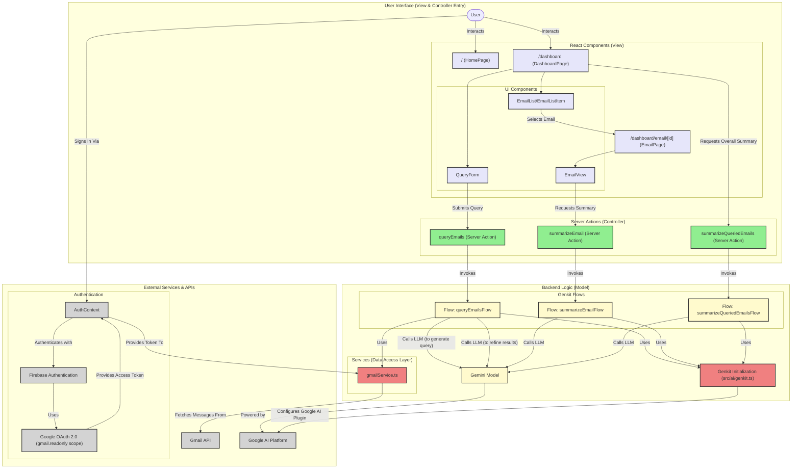

# MailSage Application Architecture

This document outlines the architecture of the MailSage application, a Next.js app using Genkit for AI-powered Gmail interaction.

## Design Pattern: Model-View-Controller (MVC)

The application is structured following the principles of the Model-View-Controller (MVC) design pattern, adapted for a modern Next.js environment. This pattern separates the application's concerns into three interconnected components:

*   **Model:** The core business logic and data management. In our app, this is primarily handled by the **Genkit Flows** (e.g., `queryEmailsFlow`) and the **Services** they call (e.g., `gmailService`). The Model is responsible for the "heavy lifting": transforming user queries, interacting with the AI, fetching data from the Gmail API, and refining the results. It knows nothing about the user interface.
*   **View:** The user interface. This consists of all the **React Components** (e.g., `QueryForm`, `EmailList`, `EmailView`). The View's job is to display the data provided by the Controller and send user actions (like button clicks or form submissions) to the Controller.
*   **Controller:** The intermediary that connects the View and the Model. This role is filled by **Next.js Server Actions** (e.g., the `queryEmails` function). When a user performs an action in the View, the Server Action is called. It then invokes the appropriate Model (Genkit Flow) to handle the request, receives the data back from the Model, and passes it back to the View to be displayed.

This separation makes the application robust, scalable, and easier to maintain. The complex AI logic is neatly encapsulated within the Genkit flows, completely decoupled from the UI presentation layer.

---

## System Architecture Diagram

The following diagram illustrates the main components of the MailSage application and their interactions, reflecting the MVC pattern.

## Data Flow Summary for a Typical Query:

1.  **Sign-In:** The user signs in via the `AuthContext`, which uses Firebase Auth and Google OAuth to get an `accessToken` for the Gmail API. This token is stored securely for the session.
2.  **User Query (View -> Controller):** The user types a query into the `QueryForm` (View) and submits it. This action calls the `queryEmails` Server Action (Controller), passing the user's query and the access token.
3.  **Processing (Controller -> Model):** The `queryEmails` Server Action (Controller) immediately calls the `queryEmailsFlow` (Model).
4.  **Genkit Flow Execution (Model):** The `queryEmailsFlow` executes its multi-step logic:
    *   **LLM Call 1:** It sends the user's natural language query to the Gemini model to transform it into a structured Gmail API search string (e.g., `from:linkedin after:2024/01/01`).
    *   **Service Call:** It passes this search string and the access token to the `gmailService`, which calls the Gmail API to fetch a list of email metadata (sender, subject, snippet, etc.).
    *   **LLM Call 2:** It takes the snippets of the fetched emails and sends them back to the Gemini model, asking it to filter for relevance and generate a concise summary for each one based on the original query's intent.
5.  **Data Return (Model -> Controller -> View):** The flow returns a structured list of `QueriedEmail` objects. The Server Action receives this list and returns it to the `DashboardPage` component (View), which updates its state and displays the results in the `EmailList`.
6.  **Overall Summary:** The `DashboardPage` then triggers a separate action, `summarizeQueriedEmails`, sending the list of individual summaries to another Genkit flow which synthesizes a single "executive summary" of the entire query result.

This architecture ensures that each part of the application has a clear, distinct responsibility, leading to a more organized and scalable system.
