# MailSage Application Architecture

This document outlines the architecture of the MailSage application, a Next.js app using Genkit for AI-powered Gmail interaction.

## System Architecture Diagram

The following diagram illustrates the main components of the MailSage application and their interactions.

```mermaid
graph LR
    %% Style for cleaner lines if supported by renderer (may not be universal)
    %% linkStyle default interpolate basis

    subgraph "User Interface (Next.js Frontend)"
        direction TB

        User(["User"])

        subgraph "Pages & Context"
            HomePage["/ (HomePage)"]
            DashboardPage["/dashboard (DashboardPage)"]
            EmailPage["/dashboard/email/[id] (EmailPage)"]
            AuthContext["AuthContext (src/contexts/AuthContext.tsx)"]
        end

        subgraph "UI Components (src/components)"
            SignInButton["SignInButton"]
            QueryForm["QueryForm"]
            EmailList["EmailList/EmailListItem"]
            EmailView["EmailView"]
            OverallSummaryDisplay["Overall Summary Card"]
        end

        User -- "Interacts" --> HomePage
        User -- "Interacts" --> DashboardPage
        User -- "Interacts" --> EmailPage

        HomePage --> SignInButton
        SignInButton -- "Triggers Google Sign-In" --> AuthContext

        DashboardPage --> QueryForm
        DashboardPage --> EmailList
        DashboardPage --> OverallSummaryDisplay

        EmailList -- "Selects Email & Navigates" --> EmailPage
        EmailPage --> EmailView

        %% Client-to-Server Action Calls
        QueryForm -- "Submits Query (1)" --> SA_queryEmails["queryEmails (Server Action)"]
        DashboardPage -- "Requests Overall Summary (3)" --> SA_summarizeQueriedEmails["summarizeQueriedEmails (Server Action)"]
        EmailView -- "Requests Full Email Summary (4)" --> SA_summarizeEmail["summarizeEmail (Server Action)"]
        EmailPage -- "Fetches Full Body (if needed via Client Call)" --> S_GmailService_ClientCall["gmailService.fetchGmailMessageBody (Client-side call if token available)"]
    end

    subgraph "Application Backend (Next.js Server Actions & Genkit)"
        direction TB

        SA_queryEmails["queryEmails (src/ai/flows/query-emails.ts)"]
        SA_summarizeQueriedEmails["summarizeQueriedEmails (src/ai/flows/summarize-queried-emails-flow.ts)"]
        SA_summarizeEmail["summarizeEmail (src/ai/flows/summarize-email.ts)"]

        GenkitInit["Genkit Initialization (src/ai/genkit.ts)"]

        SA_queryEmails -- "Input: {userQuery, accessToken}" --> F_queryEmails["Flow: queryEmails"]
        SA_summarizeQueriedEmails -- "Input: {queriedEmails}" --> F_summarizeQueriedEmails["Flow: summarizeQueriedEmails"]
        SA_summarizeEmail -- "Input: {emailContent}" --> F_summarizeEmail["Flow: summarizeEmail"]

        subgraph "Genkit Flows (Defined in Server Actions)"
            F_queryEmails
            F_summarizeQueriedEmails
            F_summarizeEmail
        end

        F_queryEmails -- "Uses" --> GenkitInit
        F_queryEmails -- "a. Get Current Date" --> F_queryEmails
        F_queryEmails -- "b. Calls LLM 1 (Transform Query)" --> M_Gemini["Gemini Model"]
        F_queryEmails -- "c. Calls (via accessToken)" --> S_GmailService_ServerCall["gmailService (Server-side)"]
        F_queryEmails -- "d. Calls LLM 2 (Refine/Summarize Snippets)" --> M_Gemini
        F_queryEmails -- "Output: List<QueriedEmail>" --> DashboardPage

        F_summarizeQueriedEmails -- "Uses" --> GenkitInit
        F_summarizeQueriedEmails -- "a. Calls LLM" --> M_Gemini
        F_summarizeQueriedEmails -- "Output: {overallSummary}" --> OverallSummaryDisplay

        F_summarizeEmail -- "Uses" --> GenkitInit
        F_summarizeEmail -- "a. Calls LLM" --> M_Gemini
        F_summarizeEmail -- "Output: {summary}" --> EmailView

        subgraph "Services (src/services)"
            S_GmailService_ClientCall
            S_GmailService_ServerCall["gmailService.ts (Server-side usage)"]
        end
    end

    subgraph "External Services & APIs"
        direction RL

        AuthContext -- "Google Sign-In" --> FirebaseAuth["Firebase Authentication"]
        FirebaseAuth <--> GoogleAccount["User's Google Account"]
        GoogleAccount <--> GoogleOAuth["Google OAuth 2.0 (gmail.readonly scope)"]
        GoogleOAuth -- "Provides Access Token" --> AuthContext
        AuthContext -- "Access Token" --> SA_queryEmails
        AuthContext -- "Access Token" --> S_GmailService_ClientCall


        S_GmailService_ServerCall -- "fetchGmailMessages()" --> GmailAPI["Gmail API (api.google.com/gmail/v1)"]
        S_GmailService_ClientCall -- "fetchGmailMessageBody()" --> GmailAPI

        M_Gemini -- "Interacts via Genkit" --> GoogleAI["Google AI Platform (Gemini)"]
        GenkitInit -- "Configures Google AI Plugin" --> GoogleAI
    end

    %% Styling (optional, makes it look a bit better in some renderers)
    classDef page fill:#e6e6fa,stroke:#333,stroke-width:2px;        %% Light purple for pages
    classDef component fill:#add8e6,stroke:#333,stroke-width:2px;   %% Light blue for UI components
    classDef serverAction fill:#90ee90,stroke:#333,stroke-width:2px;%% Light green for server actions
    classDef genkitFlow fill:#fffacd,stroke:#333,stroke-width:2px;  %% Lemon chiffon for Genkit flows
    classDef service fill:#f08080,stroke:#333,stroke-width:2px;     %% Light coral for services
    classDef external fill:#d3d3d3,stroke:#333,stroke-width:2px;    %% Light grey for external services

    class HomePage,DashboardPage,EmailPage page;
    class SignInButton,QueryForm,EmailList,EmailView,OverallSummaryDisplay,AuthContext component;
    class SA_queryEmails,SA_summarizeQueriedEmails,SA_summarizeEmail serverAction;
    class F_queryEmails,F_summarizeQueriedEmails,F_summarizeEmail genkitFlow;
    class S_GmailService_ClientCall,S_GmailService_ServerCall,GenkitInit service;
    class FirebaseAuth,GoogleAccount,GoogleOAuth,GmailAPI,GoogleAI,M_Gemini external;
```

## Data Flow Summary for a Typical Query:

1.  **User signs in:** `AuthContext` -> Firebase Auth -> Google OAuth -> `accessToken` for Gmail API stored in `AuthContext` (sessionStorage).
2.  **User types query on Dashboard:** `QueryForm` -> `queryEmails` (Server Action), passing the natural language query and the `accessToken`.
3.  **`queryEmails` Server Action / Genkit Flow:**
    *   Gets the current date.
    *   (LLM 1 - `transformQueryPrompt`) Transforms the user's natural language query into a Gmail API search string (e.g., "from:linkedin (bill OR invoice) after:2024/12/31 before:2026/01/01").
    *   `gmailService.fetchGmailMessages` is called with the `accessToken` and the AI-generated Gmail API query. This service function calls the Gmail API (`messages.list` with `q=queryString`) to get message IDs, then for each ID calls `messages.get` with `format=metadata` to retrieve sender, subject, snippet, and timestamp.
    *   (LLM 2 - `refineAndSummarizeEmailsPrompt`) Evaluates each fetched email's snippet against the original user query's intent. It filters out irrelevant emails and generates a concise, focused summary for each relevant email's snippet.
    *   Returns a list of `QueriedEmail` objects (each including id, sender, subject, original snippet, timestamp, and AI-generated summary) to the `DashboardPage`.
4.  **`DashboardPage`:**
    *   Adapts the `List<QueriedEmail>` to `List<Email>` for display in `EmailList`.
    *   Calls `summarizeQueriedEmails` (Server Action) with the list of summaries from the `QueriedEmail` objects.
5.  **`summarizeQueriedEmails` Server Action / Genkit Flow:**
    *   (LLM 3 - `summarizeQueriedEmailsPrompt`) Takes the list of individual AI-generated summaries (from the snippets) and synthesizes an overall "executive summary."
    *   Returns the `overallSummary` string to the `DashboardPage` for display in the "Overall Summary Card".
6.  **User clicks an email in `EmailList`:**
    *   The `EmailListItem` stores the clicked `Email` object in `localStorage`.
    *   Navigates to `EmailPage (/dashboard/email/[id])`.
7.  **`EmailPage` / `EmailView`:**
    *   Loads the `Email` data from `localStorage`.
    *   If the `email.body` is just the snippet (and not full HTML), `EmailPage` calls `fetchGmailMessageBody` (a client-side callable function in `gmailService.ts` that uses the `accessToken` from `AuthContext`) to get the full HTML body of the email from the Gmail API (`messages.get` with `format=full`).
    *   `EmailView` displays the email subject, sender, date.
    *   "Original Email" section renders the HTML email body using `dangerouslySetInnerHTML`.
    *   "AI Summary" section displays the existing summary (which was based on the snippet).
    *   User can click a "Summarize" or "Re-Summarize" button, which calls `summarizeEmail` (Server Action).
8.  **`summarizeEmail` Server Action / Genkit Flow:**
    *   (LLM 4 - `summarizeEmailPrompt`) Takes the full email body content.
    *   Generates a concise summary of the full email content.
    *   Returns the new `summary` to `EmailView`, which updates its display.

This Mermaid diagram should provide a good visual overview when rendered. You can paste the content of the `ARCHITECTURE.md` file into a Mermaid-compatible renderer (like the [Mermaid Live Editor](https://mermaid.live) or a VS Code extension) to see it.
